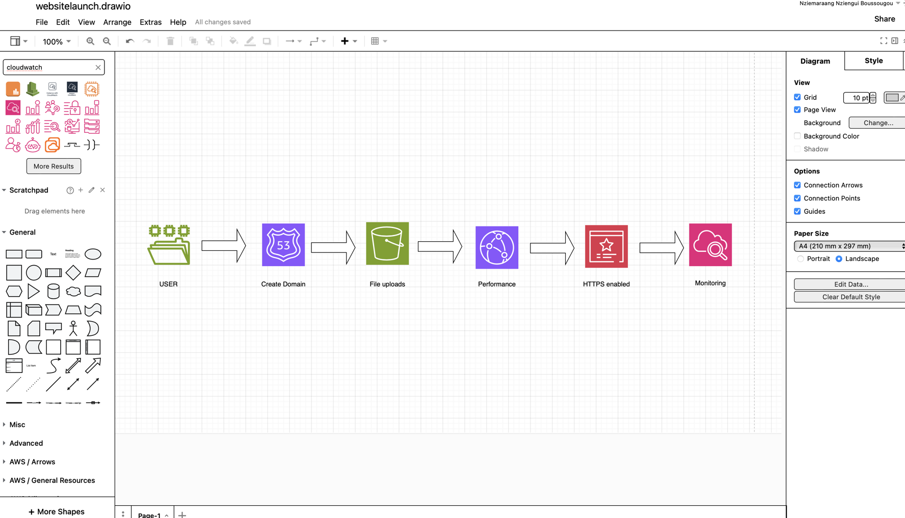

# HostingStaticWebsite
Hosting a static website with S3 and route 53.

# Overview

This project documents the end-to-end deployment of my personal portfolio website (busugu.click) using a cloud-native architecture on AWS. The implementation demonstrates how to design and deploy a secure, scalable, and high-performance static website using core AWS services.

The architecture follows best practices for static web hosting, global content delivery, DNS management, encryption, and monitoring.

---

# Architecture Components

## Hosting Layer
- Amazon S3 (Static Website Hosting)

## Content Delivery Layer
- Amazon CloudFront (CDN)

## Domain & DNS
- Amazon Route 53

## Security Layer
- AWS Certificate Manager (ACM) for SSL/TLS

## Monitoring Layer
- Amazon CloudWatch

---

# Deployment Steps

## 1. Domain Configuration (Route 53)
- Registered and configured the domain in Amazon Route 53  
- Created DNS records to map the domain to the CloudFront distribution  
- Ensured proper name resolution for global access  

---

## 2. Static Website Hosting (Amazon S3)
- Created an Amazon S3 bucket for hosting website assets  
- Enabled static website hosting configuration  
- Uploaded frontend files including HTML, CSS, and JavaScript  
- Configured `index.html` as the entry point of the application  

---

## 3. Content Delivery (Amazon CloudFront)
- Created a CloudFront distribution with the S3 bucket as the origin  
- Enabled global edge caching to improve performance  
- Reduced latency by serving content from nearest edge locations  
- Integrated CloudFront with the custom domain  

---

## 4. Security Configuration (AWS Certificate Manager)
- Provisioned an SSL/TLS certificate using AWS Certificate Manager  
- Attached the certificate to the CloudFront distribution  
- Enabled HTTPS to secure data in transit between users and the website  

---

## 5. Testing & Validation
- Verified DNS resolution through Route 53  
- Tested HTTPS access to ensure secure communication  
- Confirmed proper content delivery through CloudFront  
- Validated website accessibility across multiple devices and locations  

---

## 6. Monitoring & Observability (CloudWatch)
- Configured Amazon CloudWatch to monitor traffic and performance metrics  
- Tracked request patterns and system behavior  
- Ensured visibility into website availability and performance  

---

# Key Outcomes

- Secure HTTPS-enabled static website  
- Global low-latency content delivery using CDN  
- Scalable and cost-efficient serverless architecture  
- Fully managed DNS and domain routing  
- Basic observability and performance monitoring  

---

# Technologies Used

- Amazon S3  
- Amazon CloudFront  
- Amazon Route 53  
- AWS Certificate Manager (ACM)  
- Amazon CloudWatch 
